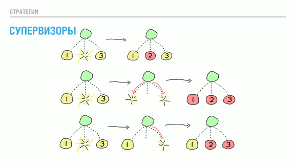
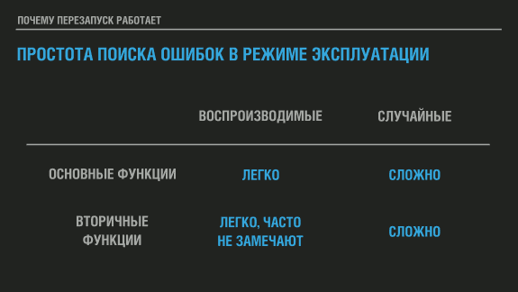
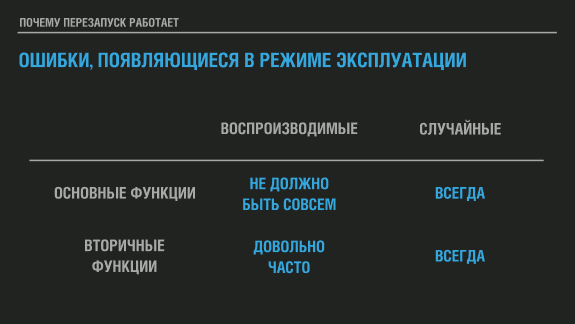
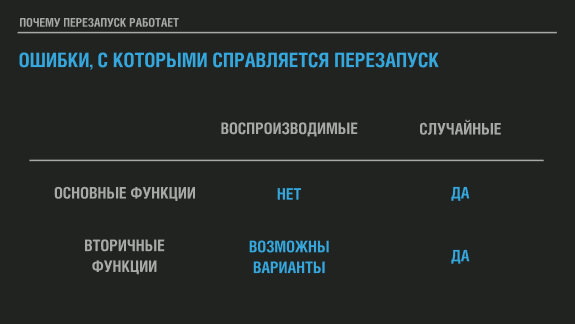
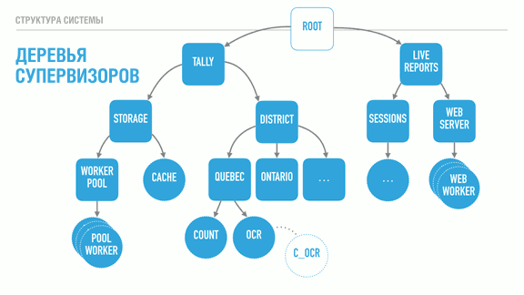

# Дзен Эрланга (и Эликсира - прим. переводчика)

*Примечание переводчика:*

*В данной статье речь идёт об [Erlang](https://ru.wikipedia.org/wiki/Erlang), но всё сказанное в равной степени применимо и к [Elixir](https://ru.wikipedia.org/wiki/Elixir_(%D1%8F%D0%B7%D1%8B%D0%BA_%D0%BF%D1%80%D0%BE%D0%B3%D1%80%D0%B0%D0%BC%D0%BC%D0%B8%D1%80%D0%BE%D0%B2%D0%B0%D0%BD%D0%B8%D1%8F)) - функциональному языку, работающему поверх той же виртуальной машины [BEAM](https://en.wikipedia.org/wiki/BEAM_(Erlang_virtual_machine)), появившемуся в 2012 году и активно развивающемуся. Этот язык получил более привычный большинству синтаксис, сохранив особенности Erlang, плюс обширные возможности [метапрограммирования](https://ru.wikipedia.org/wiki/%D0%9C%D0%B5%D1%82%D0%B0%D0%BF%D1%80%D0%BE%D0%B3%D1%80%D0%B0%D0%BC%D0%BC%D0%B8%D1%80%D0%BE%D0%B2%D0%B0%D0%BD%D0%B8%D0%B5).*

*Эрланг и Эликсир как два топора. Один старый, покрытый слоем застарелой окалины и окислов, с топорищем из неизвестной породы дерева, отполированным сотнями рук, но хорошо выкованный и правильно вручную заточенный. Второй - новенький топорик а-ля Фискарс из новейших сплавов и материалов. Но на одной и той же делянке леса с их помощью можно нарубить одинаковое количество. Просто кому-то будет удобнее со старым проверенным топором, а кому-то сподручнее с новым. Больше разницы никакой нет.*

*Некоторые термины и фразы я буду оставлять в тексте как есть, чтобы не выводить из контекста не совсем верным переводом.*

Это свободный транскрипт (или долгий парафраз?) выступления на конференции ConnectDev'16,организованной Genetec, куда меня пригласили в качестве оратора.

Я полагаю, что большинство людей здесь никогда не использовало Erlang, возможно, слышало о нём, может быть, только название. Поэтому данное выступление затронет только высокоуровневные концепции Erlang таким образом, что это может оказаться полезным в ваших рабочих или сторонних проектах даже если вы никогда не сталкиваетесь с языком.

Если вы когда-либо интересовались Erlang, то слышали об этом девизе - "Let it crash" [*"позволь этому рухнуть" - прим. переводчика*]. Моя первая встреча с ним заставила меня задуматься, что это за чертовщина? Предполагалось, что Erlang отлично подходит для многопоточного выполнения и отказоустойчивости, а здесь мне говорят позволить всему падать, что полная противоположность поведению системы, которого я на самом деле хочу. Предложение удивительно, но «дзен» Эрланга, тем не менее, имеет к нему непосредственное отношение.

В некотором смысле было бы так же забавно использовать "Let it Crash" для Эрланга, как и "Blow it up" [*"подрывай это" - прим. переводчика*] для ракетостроения. "Подрыв", пожалуй, последнее, чего вы хотите в ракетостроении, и катастрофа Челленджера - яркое напоминание об этом. Однако если вы посмотрите на это иначе, то ракеты и их движительная система целиком имеют дело с опасным топливом, которое может и будет взрываться (и это рискованный момент), но делая это столь управляемым образом, что их можно использовать для организации космических путешествий или отправки полезных грузов на орбиту.

И суть здесь действительно в контроле; вы можете попытаться посмотреть на ракетостроение как на способ правильно укротить взрывы - или, по-крайней мере, их силу, - чтобы делать с ними то, что мы захотим. В свою очередь можно взглянуть на "Let it crash" под тем же углом: это об отказоустойчивости. Идея не в повсеместных бесконтрольных сбоях, она в том, чтобы превратить сбои, исключения и падения в инструменты, которые можно использовать.

Встречный пал и управляемый отжиг - реальный пример борьбы с огнём при помощи огня. В регионе Сагене-Лак-Сен-Жан, откуда я родом, черничные поля регулярно сжигаются контролируемым образом, чтобы помочь стимулировать и возобновить их рост. Чтобы предотвратить лесные пожары, Довольно часто можно увидеть нездоровые участки леса, очищенные для предотвращения пожаров огнём так, чтобы это можно было сделать под надлежащим надзором и контролем. Основная цель заключается в том, чтобы удалить горючий материал таким образом, чтобы настоящий пожар не смог распространяться дальше.

Во всех этих ситуациях разрушительная сила огня, проходящего по посевам или лесам, используется для оздоровления посевов или предотвращения гораздо большего, неконтролируемого уничтожения лесных районов.

Я считаю, что смысл 'Let it crash' именно в  этом. Если мы можем воспользоваться сбоями, падениями и исключениями, и сделать это хорошо управляемым способом, они перестанут быть тем пугающим событием, которого необходимо избегать, и вместо этого превратятся в мощный строительный элемент для сборки больших надёжных систем.

Таким образом, вопросом становится то, как гарантировать, что сбои являются скорее созидательными, чем деструктивными. В Эрланге основной фишкой для этого является процесс. Процессы Эрланга полностью изолированы и имеют неразделяемую архитектуру (share nothing). Ни один процесс не может проникнуть в память другого или повлиять на выполняемую им работу, исказив рабочие данные. Это хорошо, поскольку означает, что умирающий процесс, по сути, гарантированно сохранит свои проблемы при себе, и обеспечивает очень сильную изоляцию отказов в вашей системе.

Процессы в Эрланге также чрезвычайно легковесны, настолько, что вы можете иметь тысячи и тысячи их без каких-либо проблем. Идея в том, чтобы использовать столько процессов, сколько вам нужно, нежели чем столько, сколько вы можете себе позволить. Создавая аналогию можно сказать, что если бы был объектно-ориентированный язык программирования, в которым в любой момент времени можно иметь максимум 32 объекта, работающих одновременно, вы бы быстро пришли к выводу, что ограничения слишком строгие и программировать на этом языке довольно нелепо. Наличие множества небольших процессов обеспечивает более высокую вариативность поломок, и в мире, где мы хотим поставить на службу силу сбоев это хорошо!

Теперь будет немного странным обрисовать то, как именно эти процессы работают. Когда вы пишете программу на C, у вас есть одна большая функция `main()`, которая делает много всего. Это ваша точка входа в программу. В Эрланге такой штуки нет. Ни один из процессов не является главным. Каждый процесс выполняет функцию, и эта функция играет роль `main()` этого конкретного процесса.

Теперь у нас есть рой пчёл, но, должно быть, довольно сложно отправить их укреплять улей, если они не могут коммуницировать каким-либо образом. Там, где пчёлы танцуют [*[танец пчёл](https://ru.wikipedia.org/wiki/%D0%A2%D0%B0%D0%BD%D0%B5%D1%86_%D0%BF%D1%87%D1%91%D0%BB) - прим. переводчика*], процессы Эрланга обмениваются сообщениями.

Обмен сообщениями - наиболее интуитивная форма коммуникации в конкурентной среде. Она - одна из старейших, с которыми сталкивались, начиная с дней, когда мы писали письма и отправляли их курьерами на лошадях и до более причудливых механизмов вроде семафоров Наполеона [*[оптический семафор](https://ru.wikipedia.org/wiki/%D0%9E%D0%BF%D1%82%D0%B8%D1%87%D0%B5%D1%81%D0%BA%D0%B8%D0%B9_%D1%82%D0%B5%D0%BB%D0%B5%D0%B3%D1%80%D0%B0%D1%84#%D0%A1%D0%B5%D0%BC%D0%B0%D1%84%D0%BE%D1%80_%D0%B1%D1%80%D0%B0%D1%82%D1%8C%D0%B5%D0%B2_%D0%A8%D0%B0%D0%BF%D0%BF) - прим. переводчика*], показанного на иллюстрации. В последнем случае вы просто отправляется кучу парней на башни, отдаёте им сообщение, и они размахивают флажками для передачи данных на длинные расстояния способами, которые были быстрее выматывающихся лошадей. Постепенно такой способ сменился телеграфом, который, в свою очередь сменили телефон и радио, а сейчас у нас есть все эти модные технологии для передачи сообщений действительно далеко и действительно быстро.

Крайне важный аспект всего этого обмена сообщениями, особенно в старые времена, в том, что всё было асинхронным, и сообщения копировались. Никто не стоял на своём крыльце целыми днями в ожидании возвращения курьера и никто (я подозреваю) не сидел возле семафора, дожидаясь реакции. Вы отправляли сообщение и возвращались к своим делам, а со временем кто-то говорил, что вам пришёл ответ.

Это хорошо, потому что если другая сторона не реагирует, вы не застреваете на своём крыльце до самой смерти. С другой стороны и получатель на противоположном  конце канала связи не обнаруживает только что прибывшее сообщение исчезнувшим или изменившимся как по волшебству в тот момент, если вы действительно умрёте. При отправке сообщения данные должны быть скопированы. Эти два принципа гарантируют, что сбой во время коммуникации не приведёт к искажённому или невосстановимому состоянию [*[состояние](https://ru.wikipedia.org/wiki/%D0%A1%D0%BE%D1%81%D1%82%D0%BE%D1%8F%D0%BD%D0%B8%D0%B5_(%D0%B8%D0%BD%D1%84%D0%BE%D1%80%D0%BC%D0%B0%D1%82%D0%B8%D0%BA%D0%B0)) - прим. переводчика*]. Эрланг реализует оба.

У каждого процесса есть единый почтовый ящик для всех входящих сообщений. Каждый может написать процессу, но только владелец ящика может прочитать отправленное. По умолчанию сообщения обрабатываются в том порядке поступления, но с помощью возможностей типа сопоставления с образцом [*[сопоставление с образцом](https://ru.wikipedia.org/wiki/%D0%A1%D0%BE%D0%BF%D0%BE%D1%81%D1%82%D0%B0%D0%B2%D0%BB%D0%B5%D0%BD%D0%B8%D0%B5_%D1%81_%D0%BE%D0%B1%D1%80%D0%B0%D0%B7%D1%86%D0%BE%D0%BC) - прим. переводчика*] возможно в конкретном случае или временно сфокусироваться на одном типе сообщений и поменять приоритеты.

Некоторые из вас заметят странность в том, я говорил; я продолжаю повторять, что изоляция и независимость настолько замечательны, что компонентам системы позволено умирать и падать, не влияя на остальные, но также я упоминал о коммуникации между множеством процессов или агентов.

Каждый раз в начале общения двух процессов создаётся неявная зависимость между ними. В системе появляется неявное состояние, которое связывает обоих между собой. Если процесс А отправляет сообщение процессу Б, и Б умирает, не ответив, А можно либо ждать ответа вечно, либо через какое-то время сдаться и отказаться от общения. Последнее - приемлемая стратегия, но очень неоднозначная: совершенно неясно, умерла ли удалённая сторона или просто так долго занята, и несвязанное сообщение приземлится в вашем ящике.

Вместо этого Эрланг даёт нам два механизм для решения: мониторы и связывание (links).

Мониторы - это о том, чтобы быть наблюдателем. Вы решаете присматривать за процессов, и если тот умирает по какой-то причине, в ваш почтовый ящик падает сообщение, сообщающее о случившемся. На это вы можете отреагировать на это и принять решение на основе недавно полученной информации. Второй процесс никогда не узнает, что вы всем этим занимались. Поэтому мониторы довольно хороши, если вы наблюдатель [*observer - наблюдаете за состоянием процессов - прим. переводчика*] или заботитесь о состоянии корреспондента.

Связи (links) - двунаправлены, и создание таковой связывает судьбу обоих связанных процессов воедино. Когда бы процесс ни умер, все связанные с ним процессы получат команду о выходе. Эта команда в свою очередь убьёт другие процессы.

Теперь всё это становится по-настоящему интересным, поскольку я могу использовать мониторы для быстрого обнаружения сбоев, и я могу использовать связывание как архитектурную конструкцию, позволяющую связать вместе несколько процессов так, чтобы сбой распространился на них как на единое целое. В момент, когда у моих независимых стротельных блоков появляются зависимости друг от друга, я могу начать вносить это в программу. Это полезно, поскольку предотвращает случайное падение системы в нестабильные частично изменённые состояния. Связи - инструмент, позволяющий разработчикам быть уверенными в том, что в конце, когда что-то ломается, оно ломается полностью и оставляет за собой чистый лист, по-прежнему не влияя на компоненты, не участвовшие в упражнении.

Для этой иллюстрации я выбрал изображение альпинистов, связанных страховочным фалом. Если альпинисты связаны только друг с другом, теперь они будут в жалком положении. Каждый раз при соскальзывании одного альпиниста остальная часть команды немедленно погибнет. Не очень хороший способ вести дела.

Вместо этого Эрланг позволяет указать, что некоторые процессы - особенные и пометить их опцией `trap_exit`. Тогда они смогут получать сигналы о выходе, отправленные через соединение, и преобразовывать их в сообщения. Это позволит им устранить неисправности и, возможно, загрузить новый процесс для совершения работы погибшего процесса. В отличие от альпинистов специальный процесс такого типа не может предотвратить падение партнёрского процесса; это уже ответственность партнёра, например, с помощью конструкций `try ... catch`. Процесс, который отлавливает выходы, по-прежнему не имеет возможности пойти поиграть с памятью другого и сохранить её, но может избежать совместной гибели.

Это становится очень важной возможностью для реализации супервизоров. Если вы никогда не слышали о них, то мы к ним вернёмся очень скоро.

Прежде, чем перейти к супервизорам, у нас всё ещё осталось несколько ингридиентов, чтобы успешно приготовить системы, которая использует падения для собственной пользы. Один из них связан с тем, как процессы планируются к запуску. Реальной аналогией для него, на которую я хотел бы сослаться, будет прилунение лунного модуля Аполлон-11 [*[Аполлон-11](https://ru.wikipedia.org/wiki/%D0%90%D0%BF%D0%BE%D0%BB%D0%BB%D0%BE%D0%BD-11) - прим. переводчика*].

Аполлон-11 - это миссия, отправившаяся на Луну в 1969 году. На этом изображении мы видим лунный модуль с Баззом Олдриным и Нейлом Армстронгом на борту, а фото сделано, я полагаю, Майклом Коллинзом, который остался в командном модуле.

На пути к посадке на Луну модуль управлялся Apollo PGNCS (Система первичного наведения, навигации и управления) [*[Apollo PGNCS](https://en.wikipedia.org/wiki/Apollo_PGNCS) - прим. переводчика*]. Система наведения выполняла несколько задач, тщательно рассчитанных под нужное количество циклов. NASA также указало, что процессор должен использоваться не более чем на 85% своей мощности, оставляя 15% свободными.

Поскольку космонавты хотели иметь надёжный резервный план на случай, если им придётся прервать миссию, они оставили включённым радар встречи с командно-служебным модулем - вдруг пригодится. Это заняло приличное количество оставшейся мощности CPU. Как только Баз Олдрин начал вводить комманды, стали появляться сообщения о переполнении и, по сути, о превышении доступной вычислительной мощности. Если бы система от этого свихнулась, то, вероятно, не смогла бы делать свою работу и всё закончилось бы двумя мёртвыми космонавтами.

В основном это произошло потому, что радар имел известную аппаратную проблему, вызывающую рассогласование его частоты с компьютером наведения, что вело к краже значительно большего количества циклов, чем использовалось бы в противном случае. Люди в NASA не были идиотами, и они повторно использовали проверенные компоненты, о редких ошибках которых они знали, вместо использования новых непроверенных технологий для столь критической миссии, но, что ещё более важно, они придумали диспетчеризацию по приоритетам.

Это означает, что даже в случае, когда этот радар или, возможно, введённые команды перегружали процессор, если их приоритет был слишком низок в сравнении с абсолютно жизненно-необходимыми вещами, задача была бы убита, чтобы дать циклы CPU тому, что на самом деле, по-настоящему в этом нуждается. Это было в 1969; сегодня всё ещё существует немало языков и фреймворков, дающих только кооперативную диспетчеризацию и ничего больше.

Эрланг - не тот язык, который стоит использовать для жизненно-важных систем, он учитывает только мягкие ограничения реального времени (soft-real time constraints), но не жёсткие ограничения реального времени, и поэтому использовать его для таких сценариев не будет хорошей идеей. Но Эрланг предоставляет диспетчеризацию по приоритетам [*она же - вытесняющая многозадачность - прим. переводчика*] и приоритезацию процессов. Это означает, что вам как разработчику или архитектору системы не нужно заботиться, чтобы для предотвращения подвисаний абсолютно все тщательно рассчитывали нагрузку на CPU, требуемую для их компонентов (включая используемые библиотеки). Им просто не продоставят такой мощности. И если нужно, чтобы какая-то важная задача выполнялась всегда, когда это необходимо - вы так же можете это обеспечить.

Это может не выглядеть как серьёзное или частое требование, и люди всё ещё выпускают действительно успешные проекты, основанные исключительно на кооперативной диспетчеризации параллельных процессов, но, безусловно, исключительно ценно, поскольку защищает вас от чужих ошибок, равно и как от ваших собственных. Это также открывает двери для таких механизмов, как автоматическое распределение нагрузки, "наказание хороших" или "поощрение плохих" процессов или назначение более высоких приорететов процессам с большой очередью задач. Всё это в конечном итоге делает ваши системы достаточно адаптируемыми к нагрузкам и непредвиденным событиям.

Последний компонент, который я хотел бы обсудить в рамках обеспечения достойной отказоустойчивости - это возможность работы в сети. В любой системе, которая разрабатывается с прицелом на долговременную активность, возможность работать на более чем одном компьютере быстро становится обязательным требованием. Вы не захотите сидеть где-то там запертым за титановыми дверями со своей золотой машиной, не имея возможности компенсировать любые отказы, влияющие главным образом на ваших пользователей.

Так что рано или поздно вам понадобится два компьютера, чтобы один выжил при поломке второго, и, возможно, третий, если появится желание развернуть часть вашей системы во время поломок.

Самолёт на иллюстрации - F-82 "Твин Мустанг" [*[F-82 "Твин Мустанг"](https://ru.wikipedia.org/wiki/North_American_F-82_Twin_Mustang) - прим. переводчика*], воздушное судно, разработанный во время второй мировой войны для сопровождения бомбардировщиков на расстояния, которые большинство других исстребителей просто не могли преодолеть. У него было две кабины, так что пилоты могли сменять друг друга при управлении; в нужный момент была возможность разделить обязанности так, что один пилот мог вести самолёт, а второй - управлять радарами в роли перехватчика. Современные воздушные суда всё ещё имеют подобные возможности; у них есть бесчисленные дублирующие системы, и часто члены экипажа спят во время полёта, чтобы при необходимости всегда был кто-то готовый немедленно принять управление самолётом.

Что касается языков программирования или контуров разработки, то большинство из них спроектированы без возможности распределённой работы, пусть и понятно, что при  разработке серверного стека вам понадобится работать более чем с одним сервером. С другой стороны, если вы собираетесь работать с файлами - в стандартной библиотеке есть инструменты для этого. Максимум, что вам может дать большинство языков - это поддержка сокетов или HTTP-клиент.

Эрланг отдаёт должное реальности распределённых систем и предлагает реализацию для этого, которая задокументирована и прозрачна. Это позволяет реализовывать хитрую логику для обработки отказов или переназначения функций упавших приложений с целью предоставить большую отказоустойчивость или даже чтобы позволить другим языка притворяться узлами Эрланга для построения систем-полиглотов [*[pylyglot systems](https://en.wikipedia.org/wiki/Polyglot_(computing)) - прим. переводчика*].

Таковы основные ингредиенты в рецепте для достижения дзена Эрланга. Весь язык построен с целью устранения и превращения сбоев и падений во что-то столь управляемое, что становится возможным использовать их в качестве инструмента. Лозунг "Let it crash" получает смысл, и применяемые тут принципы могут использоваться и в системах, реализуемых на других языках.

Собрать их вместе - следующее испытание.

Деревья наблюдателей (supervision trees) - то, с помощью чего вы реализуете структуру ваших программ на Эрланг. Они начинаются с простой концепции - супервизора (наблюдателя), - единственная задача которого - стартовать, отслеживать и перезапускать процессы в случае падений. Кстати, супервизор - один из основных компонентов "OTP", главного фреймворка разработки, вынесенного в название "Erlang/OTP" [*[OTP - Open Telecom Platform](https://ru.wikipedia.org/wiki/Open_Telecom_Platform) - прим. переводчика*].

Цель деревьев наблюдения - создать иерархию, в которой все важные вещи, которые должны быть максимально надёжными, аккумулирются ближе к корню дерева, а временные, "движущиеся" части располагаются у его листьев. Фактически, именно так настоящие деревья и выглядят: листья подвижны и их много, они опадают осенью, но дерево остаётся живым.

Это означает, что при структурировании программы на Эрланг всё, что вам кажется ненадёжным и чему позволено ломаться должно располагаться глубже в иерархии, а всё, что стабильно и критически важно - выше.

Супервизоры реализуют это с помощью связывания и захвата уведомлений о выходе (trapping exits). Их работа начинается с запуска дочерних процессов в порядке "сверху вниз, слева направо). Только после того, как однин дочерний процесс полностью запущен происходит возврат на тот же уровень и начинает запускаться следующий. Каждый дочерний процесс автоматически связывается с со своим супервизором.

При смерти дочернего процесса выбирается одна из трёх стратегий. Первая стратегия на иллюстрации называется "один за одного" (one for one) и заключается в замене только одного погибшего процесса. Эту стратегия используется, когда все потомки этого супервизора независимы друг от друга.

Вторая стратегия - "один за всех" (one for all). Она применяется в случаеях, когда все потомки зависят друг от друга. Когда погибает один из них, супервизор убивает остальные потомки перед тем, как вновь их запустить. Её стоит использовать, если потеря конкретного потомка оставит остальных в неопределённом состоянии. Представьте себе обмен сообщениями между тремя процессами, который завершается выбором. Вполне возможно, что мы не написали код, обрабатывающий гибель одного из процессов. Замена погибшего потомка новым приведёт к появлению нового участника, который тоже понятия не имеет о том, что происходит!

Подобное неконсистентное состояние теоретически опасно, если мы не определили, что происходит, когда один из процессов вносит сумятицу в процедуру голосования. Возможно, безопаснее просто убить все процессы и начать заново с известного стабильного состояния. Делая это мы уменьшаем область ошибок: лучше упасть сразу и быстро, чем медленно портить данные на долгосрочной основе.

Последняя стратегия полезна всякий раз, когда зависимость процессов связана с порядком загрузки. Её название - "оставшиеся за одного" (rest for one), и заключается она в том, что если потомок умирает, уничтожаются только те его собратья, которые были запущены после него. Затем процессы перезапускаются в том же порядке.

Дополнительно каждый супервизор имеет настраиваемые элементы управления и "уровень терпимости". Некоторым супервизорам можно до собственного аварийного завершения допустить только 1 сбой потомка в день, в то время как другим разрешено позволять 150 сбоев в секунду.

Комментарии, которые обычно появляются после упоминания о супервизорах, обычно звучат в стиле "но если мой конфигурационный файл повреждён, перезапуск ничего не исправит!"

Совершенно верное замечание. Причина, по которой перезапуск работает, заключается в природе ошибок, выявленных в промышленной экплуатации систем. Для обсуждения причин я хотел бы сослаться на термины "Гейзенбаг" [*[Гейзенбаг](https://ru.wikipedia.org/wiki/%D0%93%D0%B5%D0%B9%D0%B7%D0%B5%D0%BD%D0%B1%D0%B0%D0%B3) - прим. переводчика*] и "Борбаг" [*[Борбаг](https://ru.wikipedia.org/wiki/%D0%93%D0%B5%D0%B9%D0%B7%D0%B5%D0%BD%D0%B1%D0%B0%D0%B3#%D0%A1%D1%85%D0%BE%D0%B4%D0%BD%D1%8B%D0%B5_%D0%BF%D0%BE%D0%BD%D1%8F%D1%82%D0%B8%D1%8F) - прим. переводчика*], придуманные Jim Gray в 1985 году (я определённо рекомендую ознакомиться со всеми доступными вам статьями Jim Gray, они практически все великолепны!)

По-сути, борбаг - это ошибка, которая постоянна, наблюдаема и легко повторяема. Обычно их довольно легко объяснить. В отличие от него гейзенбаги имеют непостоянное поведение, появляющееся только при определённых обстоятельствах, и могут скрываться в результате самого факта попытки их обнаружить. Например, при использовании отладчика ошибки, связанные с многопоточностью, нередко исчезают, поскольку отладчик упорядочивает операции в системе.

Гейзенбаги - это те надоедливые ошибки, которые случаются один из тысячи, миллиона, миллиарда или триллиона. Понять, что кто-то уже некотороде время пытается обнаружить подобную ошибку, можно увидев, как он распечатывает страницы кода и, взяв кучу маркеров, уходит в работу над ними.

Определив терминологию давайте посмотрим, как часто эти типы ошибок появляются.

На иллюстрации я классифицирую борбаги как повторяемые, а гейзенбаги - как случайные.

Если борбаги присутствуют в основном функционале вашей системы, то обычно их очень просто обнаружить ещё до отгрузки системы в эксплуатацию. Будучи повторяемыми и находясь зачастую в критически важных модулях они обнаруживаются рано или поздно и исправляются до отгрузки.

Те, что случаются во вторичных, менее часто используемых функциях, гораздо больше зависят от небрежности. Любой согласится, что попытка исправить все ошибки в системе - это неравный бой с убывающей отдачей; выпалывание всех этих маленьких изъянов требует по мере продвижения непропорционально больше времени. Обычно второстепенные функции привлекают меньше внимания, поскольку либо использовать их будет меньше заказчиков, либо влиять на удовлетворённость пользователей они будут не так сильно. Или, как вариант, их исправить планируется позднее, и скользящий график в конце концов постоянно сдвигает сроки.

В любом случае, их легко найти, мы просто не хотим тратить время или ресурсы на это.

Гейзенбаги же найти во время разработки практически невозможно. Модные способы вроде формальных доказательств, проверки модели, исчерпывающего тестирования или тестирования на основе свойств [*[Property-Based Testing Basics](https://ferd.ca/property-based-testing-basics.html), [Property-based testing](https://medium.com/@vporoshok/property-based-testing-642cb7f9817f)  - прим. переводчика*] могут увеличить вероятность все или часть из них (в зависимости от используемых инструментов), но будем честны - немногие из нас используют хоть что-то из этого, если только не решают критически важную задачу. Чтобы обнаружить проявляющуюся один раз на миллиард ошибку требуется довольно много тестов и проверок, и есть вероятность, что даже если вы её обнаружили, не сможете повторить снова.

В качестве следующей вводной я хотел бы рассмотреть частоту появления каждого из этих типов ошибок в продуктивной эксплуатации (с точки зрения моего опыта). Не существует очевидных доказательств связи между привычкой искать ошибки и частотой их проявления в эксплуатируемых системах, но моё внутреннее чувство говорить, что такая связь есть.

Прежде всего, легко повторяемые ошибки в основных функциях просто не должны попадать в эксплуатацию. Если это случается, вы, по сути, отгрузили нерабочий продукт, и никакое количество перезапусков не поможет вашим пользователям. Такие ошибки требуют модификации кода и могут быть результатом некоторых глубоко укоренившихся проблем организации-разработчика.

Повторяемые ошибки в побочных функциях довольно часто попадают в эксплуатацию. Я считаю, что это результат недостаточного тестирование, но существует также большая вероятность, что вторичные функции часто остаются без внимания, когда речь идет о частичном рефакторинге, или что люди, занимающиеся проектированием таких функций, не в полной мере учитывают их согласованность и соответствие остальной части системы.

С другой стороны, случайные ошибки будут появляться всё чёртово время. Jim Gray, придумавший эти термины, говорил, что на 132 ошибки, замеченных у определённого количества клиентов, только одна была борбагом. 131 из 132 ошибок, найденных в эксплуатации, были гейзенбагами. Их тяжело поймать, и если это действительно статистические ошибки, то они могут показаться один раз из миллиона, просто потребуется некоторая нагрузка на вашу систему для того, чтобы они проявлялись постоянно; ошибка, возникающая в одном случае на миллиард, будет появляться каждые 3 часа в системах, обрабатывающих 100 000 запросов в секунду, а если ошибка возникает один раз на миллион -  в такой системе она будет показываться каждые 10 секунд, но в тестах её проявление будет по-прежнему редким.

Это очень много ошибок, и очень много сбоев, если не обрабатывать их правильно.

Так насколько на самом деле эффективна перезагрузка в качестве стратегии?

Ну, для повторяемых ошибок в основных функциях системы перезагрузка бесполезна. Для повторяемых ошибок в менее часто используемых фрагментах кода могут быть варианты; если функция очень важна для очень небольшого количества пользователей, перезагрузка мало что исправит. Если второстепенная функция используется всеми, но не сильно их заботит перезагрузка или игнорирование сбоя могут сработать. Например, если бы функция "Подмигнуть" на Facebook была сломана (если бы всё ещё существовала), не особо много пользователей обратило бы на это внимание или посчитало, что их впечатление от пользования Facebook в результате этого сбоя оказалось негативным.

Поэтому для случайных ошибок перезагрузка чрезвычайно эффективна, а таковые, как правило, составляют основную массу ошибок, с которыми вы столкнётесь вживую. Поскольку их сложно воспроизвести из-за того, что их появление зачастую зависит от очень специфических обстоятельств или сочетаний фрагментов данных в системе, перезагрука скорее всего заставит их исчезнуть.

Возврат к доподлинно стабильному состоянию и новая попытка к вряд ли приведёт к той же самой ненормальной ситуации, вызвавшей ошибку. Именно так: то, что могло бы стать катастрофой превратилось едва ли в более, чем небольшую заминку, с которой некоторые пользователи быстро учатся жить.

Позднее вы сможете использовать логгирование, трассировку или различные инструменты диагностических инструментов (все из которых включены в Эрланг по-умолчанию), чтобы найти, понять и исправить проблемы окончательно. Или решить, что эти проблемы трогают вас меньше, потому как усилий для их устранения нужно приложить слишком много.

Вопрос на иллюстрации мне задали на форме, где я обсуждал всякую всячину о программировании, в том числе обсуждал модель Эрланга. Я скопировал его дословно, поскольку это отличный пример вопроса, который задаёт множество людей, услышав о перезапуске и возаожмностях Эрланга.

Я хочу разобрать ситуацию предметно, на реальном примере показав, как на Эрланге можно спроектировть систему, что продемонстирует его особенности.

С помощью супервизоров (квадраты) мы можем начать создавать глубокие иерархии процессов. В данном случае речь идёт и системе выборов, с двумя деревьями: дерево итогов и дерево отчётов в реальном времени. Дерево итогов служит для подсчёта и хранения результатов, а дерево отчётов даёт людям возможность подключаться для просмотра результатов.

В соответствии с порядком определения потомков отчеты в реальном времени не будут запускаться до тех пор, пока дерево итогов не загрузится и не начнёт функционировать. Дерево округов (служит для расчёта результатов на уровне округа) не запустится до того, как станет доступным слой хранения. Кэш подсистемы хранения запустится только если заработает пул рабочих процессов (которые обеспечивают соединение с базой данных).

Стратегии наблюдения (supervision strategies), о которых я упоминал ранее, позволяют нам явно указать эти требования в структуре программы, и они будут соблюдаться и во время выполнения, а не только в момент запуска. Например, супервизор итогов может использовать стратегию "один за одного", подразумевая, что индивидуальные супервизоры округов могут аварийно завершаться, не влияя на подсчёты других округов. В противоположность этому каждый округ (супервизоры Квебека и Онтарио) могут использовать стратегию "все за одного". В результате эта стратегия гарантирует, что процесс распознавания (OCR) всегда может отправить обнаруженные голоса в процесс счётчика и может часть падать, не влияя на подсчёт. С другой стороны, если процесс счётчика не может хранить и передавать результаты в базу данных, его гибель прерывает процедуру распознавания, гарантируя, что ничего не теряется.

Ещё один момент, который стоит упомянуть, заключается в том, что каждый супервизор имеет конфигурируемую устойчивость к отказам; супервизоры округов могут быть очень устойчивыми и позволять 10 сбоев в минуту, в то время как слой хранения для корректной работы может быть настроен наблюдать не более 3 падений в час, если мы так решим.

В этом программе критически важные функции, неизменные и надёжные, находятся ближе к корню дерева. Их не затрагивает гибель других сиблингов, но их собственные сбои влияют на всех остальных. Листья при этом делают всю работу и могут быть потеряны довольно легко - как только они впитали данные и провели на них фотосинтез, им разрешено уйти.

In this program, critical features are closer to the root of the tree, unmoving and solid. They are unimpacted by their siblings' demise, but their own failure impacts everyone else. The leaves do all the work and can be lost fairly well — once they have absorbed the data and operated their photosynthesis on it, it is allowed to go towards the core.