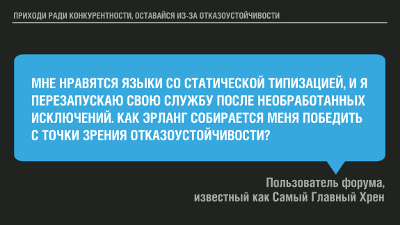
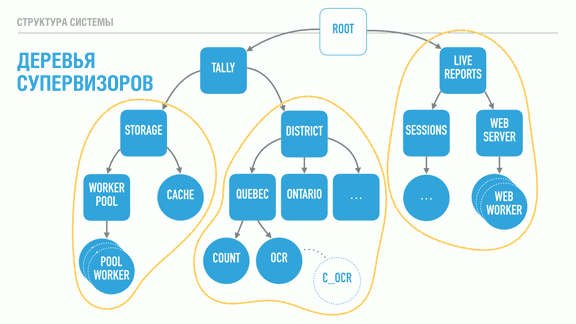
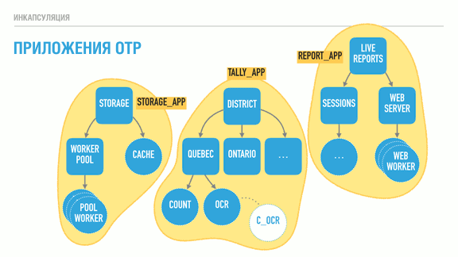
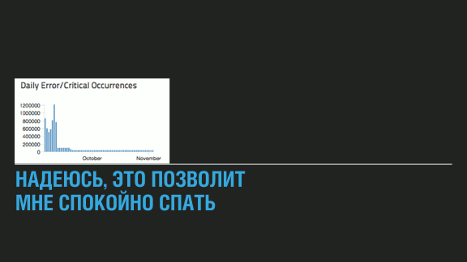
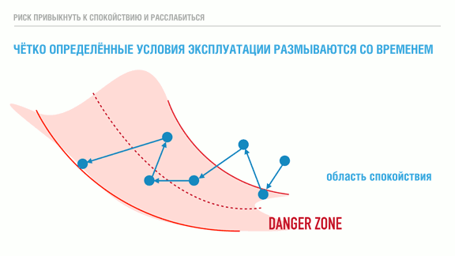
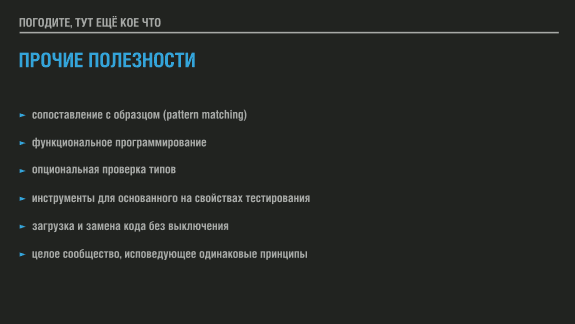

Перевод, оригинал находится в [блоге автора](https://ferd.ca/the-zen-of-erlang.html).

## *Введение от переводчика*

*В данной статье речь идёт об [Erlang](https://ru.wikipedia.org/wiki/Erlang), но всё сказанное в равной степени применимо и к [Elixir](https://ru.wikipedia.org/wiki/Elixir_(%D1%8F%D0%B7%D1%8B%D0%BA_%D0%BF%D1%80%D0%BE%D0%B3%D1%80%D0%B0%D0%BC%D0%BC%D0%B8%D1%80%D0%BE%D0%B2%D0%B0%D0%BD%D0%B8%D1%8F)) - функциональному языку, работающему поверх той же виртуальной машины [BEAM](https://en.wikipedia.org/wiki/BEAM_(Erlang_virtual_machine)), появившемуся в 2012 году и активно развивающемуся. Этот язык получил более привычный большинству синтаксис, сохранив особенности Erlang, плюс обширные возможности [метапрограммирования](https://ru.wikipedia.org/wiki/%D0%9C%D0%B5%D1%82%D0%B0%D0%BF%D1%80%D0%BE%D0%B3%D1%80%D0%B0%D0%BC%D0%BC%D0%B8%D1%80%D0%BE%D0%B2%D0%B0%D0%BD%D0%B8%D0%B5).*

*Эрланг и Эликсир как два топора. Один старый, покрытый слоем застарелой окалины и окислов, с топорищем из неизвестной породы дерева, отполированным сотнями рук, но хорошо выкованный и правильно вручную заточенный. Второй - новенький топорик а-ля Фискарс из новейших сплавов и материалов. Но на одной и той же делянке леса с их помощью можно нарубить одинаковое количество. Просто кому-то будет удобнее со старым проверенным топором, а кому-то сподручнее с новым. Больше разницы никакой нет.*

*Статья довольно старая - 2016 года, но речь в ней идёт о базовых концепциях, устареть которым сложно.*

*Некоторые термины и фразы я буду оставлять в тексте как есть, чтобы не выводить из контекста не совсем верным переводом.*

*Ссылки на понятия и комментарии от меня (переводчика) расположены в квадратных скобках `[]` и снабжены указателем "прим. переводчика".*

*Если вы найдёте какие-то части перевода недостаточно корректными, особенно в плане терминов, или столкнётесь с любыми ошибками - дайте мне, пожалуйста, знать. Я практически не общаюсь с русским сообществом Erlang\Elixir, только с англоязычным, поэтому могу быть не в курсе устоявшейся терминологии.*

# Дзен Эрланга [и Эликсира - прим. переводчика]

Это свободная расшифровка (или долгий парафраз?) презентации на конференции ConnectDev'16, организованной Genetec, выступить куда меня пригласили.

Я полагаю, что большинство людей, присутствующих здесь, никогда не программировало на Эрланге. Возможно, вы слышали о нём, может быть, только название. Поэтому моё выступление затронет только высокоуровневные концепции Эрланга, причём таким образом, что может оказаться полезным в ваших рабочих или побочных проектах, даже если вы никогда не сталкиваетесь с этим языком.

Если вы когда-либо интересовались Эрлангом, то слышали о девизе "Let it crash" [*"Пусть падает" - прим. переводчика*]. Моя первая встреча с ним заставила меня задуматься о чём, черт возьми, речь. Предполагалось, что Эрланг отлично подходит для многопоточного выполнения и отказоустойчивости, а здесь мне предлагают позволить всему падать: полная противоположность поведению системы, которого я на самом деле хочу. Предложение удивительное, но, тем не менее, "Дзен" Эрланга имеет к нему непосредственное отношение.

В некотором смысле использовать "Let it Crash" для Эрланга так же забавно, как и "Blow it up" [*"Взрывай!" - прим. переводчика*] для ракетостроения. "Взрывать", пожалуй, последнее, чего вы хотите в ракетостроении, и катастрофа Челленджера - яркое напоминание об этом. С другой стороны, если вы посмотрите на это иначе, то ракеты и вся их движительная система имеют дело с опасным топливом, которое может и будет взрываться (и это рискованный момент), но делая это столь управляемым образом, что их можно использовать для организации космических путешествий или отправки полезных грузов на орбиту.

И суть здесь действительно в контроле; можно попытаться взглянуть на ракетостроение как на способ правильно укротить взрывы - или, по-крайней мере, их мощь, - чтобы делать с ними то, что захочется. В свою очередь можно взглянуть на "Let it crash" под тем же углом: это об отказоустойчивости. Идея не в повсеместных бесконтрольных сбоях, она в том, чтобы превратить сбои, исключения и падения в инструменты, которые можно использовать.

Встречный пал [*[встречный пал](https://ru.wikipedia.org/wiki/%D0%92%D1%81%D1%82%D1%80%D0%B5%D1%87%D0%BD%D1%8B%D0%B9_%D0%BF%D0%B0%D0%BB) - прим. переводчика*] и управляемый отжиг - реальный пример борьбы с огнём при помощи огня. В Сагеней–лак-Сен-Жан, регионе, откуда я родом, черничные поля регулярно сжигаются управляемым образом, чтобы помочь стимулировать и возобновить их рост. Довольно часто можно увидеть нездоровые участки леса, очищенные огнём для предотвращения лесных пожаров, чтобы это происходило под надлежащим надзором и контролем. Основная цель заключается в удалении горючего материала так, чтобы природный пожар не смог распространяться дальше.

Во всех этих ситуациях разрушительная сила огня, проносящегося сквозь посевы или леса, используется для оздоровления сельскохозяйственных культур или предотвращения гораздо большего, неуправляемого уничтожения лесных массивов.

Я считаю, что смысл "Let it crash" именно в этом. Если мы сможем воспользоваться сбоями, падениями и исключениями, и сделать это достаточно управляемым способом, то они перестанут быть тем пугающим событием, которого необходимо избегать, и взамен превратятся в мощный строительный элемент для сборки больших надёжных систем.

Таким образом, вопросом становится как гарантировать, что сбои являются скорее созидательными, чем деструктивными. Основной фишкой для этого в Эрланге является процесс. Процессы Эрланга полностью изолированы и имеют неразделяемую архитектуру (share nothing). Ни один процесс не может забраться в память другого или повлиять на выполняемую им работу, исказив используемые данные. Это хорошо, поскольку означает, что умирающий процесс со 100% гарантией сохранит свои проблемы при себе, и обеспечивает вашей системе очень сильную изоляцию неисправностей.

Процессы в Эрланге также чрезвычайно легковесны, поэтому тысячи и тысячи их могут работать одновременно без проблем. Идея в том, чтобы использовать столько процессов, сколько вам *нужно*, нежели столько, сколько вы *можете себе позволить*. Можно провести аналогию: если бы существовал объектно-ориентированный язык программирования, в которым в любой момент времени разрешено иметь максимум 32 объекта, работающих одновременно, вы бы быстро пришли к выводу, что для создания программ на нём ограничения излишне строгие и довольно нелепые. Наличие множества небольших процессов обеспечивает более высокую вариативность поломок, и в мире, где мы хотим поставить на службу силу сбоев, это хорошо!

Описание того, как именно эти процессы работают, может показаться немного странным. Когда вы пишете программу на C, у вас есть одна большая функция `main()`, которая делает кучу всего. Это точка входа в программу. В Эрланге такой штуки нет. Ни один из процессов не является главным. Каждый процесс запускает функцию, и эта функция играет роль `main()` данного конкретного процесса.

Теперь у нас есть рой пчёл, но, должно быть, очень сложно отправить их укрепить улей, если они не могут каким-либо образом общаться. Там, где пчёлы танцуют [*[танец пчёл](https://ru.wikipedia.org/wiki/%D0%A2%D0%B0%D0%BD%D0%B5%D1%86_%D0%BF%D1%87%D1%91%D0%BB) - прим. переводчика*], процессы Эрланга обмениваются сообщениями.

Обмен сообщениями - наиболее интуитивная форма коммуникации в конкурентной среде. Она - одна из старейших, с которыми люди имели дело, начиная с дней, когда мы писали письма и отправляли их курьерами на лошадях, и до более причудливых механизмов вроде семафоров Наполеона [*[оптический семафор](https://ru.wikipedia.org/wiki/%D0%9E%D0%BF%D1%82%D0%B8%D1%87%D0%B5%D1%81%D0%BA%D0%B8%D0%B9_%D1%82%D0%B5%D0%BB%D0%B5%D0%B3%D1%80%D0%B0%D1%84#%D0%A1%D0%B5%D0%BC%D0%B0%D1%84%D0%BE%D1%80_%D0%B1%D1%80%D0%B0%D1%82%D1%8C%D0%B5%D0%B2_%D0%A8%D0%B0%D0%BF%D0%BF) - прим. переводчика*], показанного на иллюстрации. В последнем случае вы просто отправляется кучу парней на башни, отдаёте им сообщение, и они размахивают флажками для передачи данных на большие расстояния способами, которые были быстрее устающих лошадей. Постепенно такой способ заменили телеграфом, который, в свою очередь сменили телефон и радио, а сейчас у нас есть все эти модные технологии для передачи сообщений действительно далеко и действительно быстро.

Крайне важный аспект всего этого обмена сообщениями, особенно в былые дни, в том, что всё было асинхронным, а сообщения копировались. Никто не стоял на своём крыльце целыми днями в ожидании возвращения курьера и никто (я подозреваю) не сидел возле семафора, дожидаясь ответа. Вы отправляли сообщение и возвращались к своим делам, а со временем кто-то сообщал вам, что пришёл ответ.

Это хорошо, потому что если другая сторона не отвечает, вы не застраняете на своём крыльце до самой смерти. И наоборот, и получатель с другой стороны не обнаружит только что прибывшее сообщение как по волшебству исчезнувшим или изменившимся, если вы умираете. Данные *должны* копироваться при отправке сообщений. Эти два принципа гарантируют, что сбой во время коммуникации не приведёт к искажённому или невосстановимому состоянию [*[состояние](https://ru.wikipedia.org/wiki/%D0%A1%D0%BE%D1%81%D1%82%D0%BE%D1%8F%D0%BD%D0%B8%D0%B5_(%D0%B8%D0%BD%D1%84%D0%BE%D1%80%D0%BC%D0%B0%D1%82%D0%B8%D0%BA%D0%B0)) - прим. переводчика*]. Эрланг реализует оба.

У каждого процесса есть собственный почтовый ящик для всех входящих сообщений. Любой может написать в почтовый ящик процесса, но только владелец ящика имеет возможность в него заглянуть. По умолчанию сообщения обрабатываются в порядке поступления, но с помощью возможностей типа сопоставления с образцом [*[сопоставление с образцом](https://ru.wikipedia.org/wiki/%D0%A1%D0%BE%D0%BF%D0%BE%D1%81%D1%82%D0%B0%D0%B2%D0%BB%D0%B5%D0%BD%D0%B8%D0%B5_%D1%81_%D0%BE%D0%B1%D1%80%D0%B0%D0%B7%D1%86%D0%BE%D0%BC) - прим. переводчика*] возможно постоянно или временно сосредоточиться на одном виде сообщений и поменять приоритеты.

Некоторые из вас заметят странность в том, я упоминал; я продолжаю повторять, что изоляция и независимость настолько замечательны, что компонентам системы позволено умирать и падать, не влияя на остальные, но также я упомянул о коммуникации между множеством процессов или агентов.

Каждый раз в начале диалога двух процессов появляется неявная зависимость между ними. В системе возникает неявное состояние, которое связывает между собой обоих. Если процесс А отправляет сообщение процессу Б, и Б умирает, не ответив, А может либо ждать ответа вечно, либо через какое-то время отказаться от общения. Второе - приемлемая стратегия, но очень неоднозначная: совершенно неясно, удалённая сторона умерла или просто так долго занята, а сообщения без контекста могут приземлятся в вашем ящике.

Взамен Эрланг даёт нам два механизм для решения этой проблемы: мониторы и связывание [*links - прим. переводчика*].

Мониторы - это о том, чтобы быть наблюдателем. Вы решаете присматривать за процессом, и если тот умирает по какой-то причине, в ваш почтовый ящик падает сообщение, уведомляющее о случившемся. На это вы можете отреагировать и принимать решения на основе обнаруженной информации. Второй процесс никогда не узнает, что вы всем этим занимались. Поэтому мониторы довольно хороши, если вы наблюдатель [*observer - наблюдаете за состоянием процессов - прим. переводчика*] или заботитесь о состоянии партнёра.

Связи [*links - прим. переводчика*] - двунаправлены, и создание таковой скрепляет судьбу обоих связанных процессов воедино. Когда процесс умирает, все связанные с ним процессы получают команду на завершение [*exit signal - прим. переводчика*]. Эта команда, в свою очередь, убивает другие [*связанные - прим. переводчика*] процессы.

Всё это становится по-настоящему интересным, поскольку можно использовать мониторы для быстрого обнаружения сбоев, и можно использовать связывание как архитектурную конструкцию, позволяющую объединить несколько процессов так, чтобы сбой распространился на них как на единое целое. Всякий раз, когда у моих независимых строительных блоков появляются зависимости друг от друга, я могу начать вносить это в программу. Это полезно, поскольку предотвращает случайное падение системы в нестабильные частично изменённые состояния. Связи - инструмент, гарантирующий разработчикам, что в конце, когда что-то ломается, оно ломается полностью и оставляет за собой чистый лист, по-прежнему не влияя на компоненты, не принимавшие участие в упражнении.

Для этой иллюстрации я выбрал изображение альпинистов, связанных страховочным фалом. Если альпинисты связаны только друг с другом, они окажутся в жалком положении. Каждый раз при соскальзывании одного альпиниста остальная часть команды немедленно погибнет. Не очень хороший способ вести дела.

Вместо этого Эрланг позволяет указать, что некоторые процессы - особенные, и пометить их параметром `trap_exit`. Тогда они смогут получать команды на выход, отправленные через связи [*links - прим. переводчика*], и преобразовывать их в сообщения. Это позволит им устранить неисправности и, возможно, загрузить новый процесс для выполнения работы погибшего. В отличие от альпинистов специальный процесс такого типа не может предотвратить падение партнёрского процесса; это уже ответственность самого партнёра, реализуемая, например, с помощью конструкций `try ... catch`. Процесс, который отлавливает выходы, по-прежнему не имеет возможности поиграть в памяти другого и сохранить её, но может избежать совместной гибели.

Это становится решающей возможностью для создания супервизоров. Если вы никогда не слышали о них, то мы доберёмся к этому очень скоро.

Прежде, чем перейти к супервизорам, взглянем на несколько оставшихся ингредиентов, чтобы успешно приготовить систему, использующую падения для собственной пользы. Один из них связан с тем, как работает планировщик процессов. Реальный случай, на который я хотел бы сослаться - это посадка на Луну Аполлона-11 [*[Аполлон-11](https://ru.wikipedia.org/wiki/%D0%90%D0%BF%D0%BE%D0%BB%D0%BB%D0%BE%D0%BD-11) - прим. переводчика*].

Аполлон-11 - это миссия, отправившаяся на Луну в 1969 году. На изображении мы видим лунный модуль с Баззом Олдриным и Нейлом Армстронгом на борту, а фото сделано, я полагаю, Майклом Коллинзом, который оставался в командном модуле.

На пути к посадке на Луну модуль управлялся Apollo PGNCS (Система первичного наведения, навигации и управления) [*[Apollo PGNCS](https://en.wikipedia.org/wiki/Apollo_PGNCS) - прим. переводчика*]. Система управления выполняла несколько задач с тщательно рассчитанным количество циклов [*CPU - прим. переводчика*] каждой. NASA также установило, что процессор должен использоваться не более чем на 85% своей мощности, имея свободные 15% в запасе.

Поскольку космонавты хотели иметь надёжный резервный план на случай, если придётся прервать миссию, они оставили включённым радар встречи с командно-служебным модулем - вдруг пригодится. Это заняло приличное количество оставшейся мощности CPU. Как только Баз Олдрин начал вводить комманды, стали появляться сообщения о перегрузке и, по сути, о превышении доступной вычислительной мощности. Если бы система от этого свихнулась, то, вероятно, не смогла бы сделать свою работу, и всё закончилось бы двумя мёртвыми космонавтами.

В первую очередь перегруз произошёл потому, что радар имел известную аппаратную проблему, вызывающую рассогласование его частоты с компьютером управления, что вело к "воровству" значительно большего количества циклов, чем использовалось бы в противном случае. Люди в NASA не были идиотами и вместо применения для столь критической миссии новых неоттестированных в реальной работе технологий повторно использовали проверенные компоненты, о редких ошибках которых они знали, но, что ещё более важно, они придумали диспетчеризацию по приоритетам.

Это означает, что даже в случае, когда этот радар или, возможно, введённые команды давали на процессор слишком большую нагрузку, если их приоритет был слишком низок в сравнении с абсолютно жизненно-необходимыми вещами, задача была бы убита, чтобы дать циклы CPU тому, что по-настоящему в этом нуждается. Это было в 1969; сегодня существует ещё немало языков и фреймворков, предлагающих *только* кооперативную диспетчеризацию и ничего больше.

Эрланг - не тот язык, который стоит использовать для жизненно-важных систем, он учитывает только мягкие ограничения реального времени [*soft-real time constraints - прим. переводчика*], а не жёсткие ограничения реального времени, и поэтому использовать его для таких сценариев будет не очень хорошей идеей. Но Эрланг предоставляет упреждающее планирование [*она же - вытесняющая многозадачность, preemptive scheduling - прим. переводчика*] и приоритезацию процессов. Это значит, что вы, как разработчи или архитектор системы, *не обязаны* заботиться, чтобы для предотвращения подвисаний абсолютно все тщательно рассчитывали нагрузку на CPU, требуемую для их компонентов (включая используемые библиотеки). Им просто не предоставят такую мощность. И если нужно, чтобы какая-то важная задача выполнялась всегда, когда это необходимо, вы также можете это обеспечить.

Это не выглядит как серьёзное или частое требование, и люди всё ещё выпускают действительно успешные проекты, основанные исключительно на кооперативной диспетчеризации параллельных процессов, но, безусловно, исключительно ценно, поскольку защищает вас от чужих ошибок, равно и как от ваших собственных. Это также открывает двери для таких механизмов, как автоматическое распределение нагрузки, "наказание плохих" или "поощрение хороших" процессов или назначение более высоких приоритетов процессам с большим количеством задач. Всё это в конечном итоге делает ваши системы достаточно адаптируемыми к нагрузкам и непредвиденным событиям.

Последний компонент, который я хотел бы обсудить в рамках обеспечения достойной отказоустойчивости - это возможность работы в сети. В любой системе, которая разрабатывается с прицелом на долговременную активность, возможность запускаться на более чем одном компьютере быстро становится обязательным требованием. Вы не захотите сидеть где-то там запертым за титановыми дверями со своей золотой машиной, не имея возможности компенсировать отказы, влияющие главным образом на ваших пользователей.

Так что рано или поздно вам понадобится два компьютера, чтобы один выжил при сбое второго, и, возможно, третий, если появится желание развернуть часть вашей системы во время поломок.

Самолёт на иллюстрации - F-82 "Твин Мустанг" [*[F-82 "Твин Мустанг"](https://ru.wikipedia.org/wiki/North_American_F-82_Twin_Mustang) - прим. переводчика*], воздушное судно, разработанное во время второй мировой войны для сопровождения бомбардировщиков на расстояния, которые большинство других исстребителей просто не могли преодолеть. У него было две кабины, так что пилоты могли управлять аппаратом посменно; в нужный момент была возможность разделить обязанности так, что один пилот мог вести самолёт, а второй - управлять радарами в роли перехватчика. Современные воздушные суда по-прежнему имеют подобные возможности; у них есть бесчисленные дублирующие системы, и часто члены экипажа спят во время полёта, чтобы всегда был кто-то, готовый при необходимости немедленно принять на себя управление самолётом.

Что касается языков программирования или сред разработки, то большинство из них спроектированы без возможности распределённой работы, хотя и понятно, что при разработке серверного стека вам понадобится работать более чем с одним сервером. Тем не менее, если вы собираетесь работать с файлами - в стандартной библиотеке есть инструменты для этого. Максимум, что вам может дать большинство языков - это поддержка сокетов или HTTP-клиент.

Эрланг отдаёт должное реальности распределённых систем и предлагает реализацию для их создания, которая задокументирована и прозрачна. Это позволяет реализовать хитрую логику для обработки отказов или перенаправления функций упавших приложений с целью предоставить большую отказоустойчивость, или даже для того, чтобы позволить другим языкам притворяться узлами Эрланга для построения систем-полиглотов [*[pylyglot systems](https://en.wikipedia.org/wiki/Polyglot_(computing)) - прим. переводчика*].

Таковы основные ингредиенты в рецепте "Дзен Эрланга". Весь язык построен с целью превращения сбоев и падений во что-то столь управляемое, что становится возможным использовать их в качестве инструмента. Лозунг "Let it crash" получает смысл, а применяемые тут принципы могут по большей части использоваться и в системах, реализуемых на других языках.

Собрать их вместе - следующее испытание.

Деревья супервизоров [*supervision trees - прим. переводчика*] - то, с помощью чего вы реализуете структуру ваших программ на Эрланг. Они начинаются с простой концепции - супервизора, - единственная задача которого - стартовать, отслеживать и в случае падений перезапускать процессы. Кстати, супервизор - один из основных компонентов "OTP", общего фреймворка разработки, вынесенного в название "Erlang/OTP" [*[OTP - Open Telecom Platform](https://ru.wikipedia.org/wiki/Open_Telecom_Platform) - прим. переводчика*].

Цель деревьев наблюдения - создать иерархию, в которой все важные вещи, которые должны быть максимально надёжными, аккумулирются ближе к корню дерева, а временные, "движущиеся" части располагаются в районе его листьев. Фактически, именно так настоящие деревья и выглядят: листья подвижны и их много, они опадают осенью, но дерево остаётся живым.

Это означает, что при структурировании программы на Эрланг всё, что вам кажется ненадёжным и чему позволено ломаться должно располагаться ниже в иерархии, а всё, что стабильно и критически важно - выше.

Супервизоры реализуют это с помощью связывания и захвата команд на выход. Их работа начинается с запуска дочерних процессов в порядке "сверху вниз, слева направо". Только после того, как один дочерний процесс полностью запущен происходит возврат на тот же уровень и начинает запускаться следующий. Каждый дочерний процесс автоматически связывается со своим супервизором.

При смерти дочернего процесса выбирается одна из трёх стратегий. Первая стратегия на иллюстрации называется "один за одного" [*one for one* - прим. переводчика*] и заключается в замене только одного конкретного погибшего процесса. Эта стратегия используется, когда все потомки данного супервизора независимы друг от друга.

Вторая стратегия - "один за всех" [*one for all* - прим. переводчика*]. Она применяется в случаях, когда все потомки зависят друг от друга. Если погибает один из них, супервизор убивает остальные перед тем, как вновь их все запустить. Её стоит использовать, если потеря конкретного потомка оставит остальных в неопределённом состоянии. Представьте себе обмен сообщениями между тремя процессами, который завершается голосованием. Вполне возможно, что мы предусмотрели код, обрабатывающий гибель одного из процессов. Замена погибшего потомка новым приведёт к появлению нового участника, который тоже понятия не имеет о том, что происходит!

Подобное противоречивое состояние теоретически опасно, если мы не определили, что происходит, когда один из процессов нарушает процедуру голосования. Возможно, безопаснее просто убить все процессы и начать заново с наверняка стабильного состояния. Делая это мы уменьшаем область ошибок: лучше упасть сразу и быстро, чем медленно искажать данные на долгосрочной основе.

Последняя стратегия полезна всякий раз, когда зависимость процессов определяется порядком загрузки. Её название - "оставшиеся за одного" [*rest for one* - прим. переводчика], и заключается она в том, что если потомок умирает, уничтожаются только те его сиблинги, которые были запущены после него. Затем все эти процессы перезапускаются в том же порядке.

Дополнительно каждый супервизор имеет настраиваемые способы управления [*например, способом перезапуска - процессы могут быть убиты разными методами - прим. переводчика*] и уровень предельно допустимого количества сбоев потомка. Некоторым супервизорам можно до собственного аварийного завершения допустить только 1 сбой потомка в день, в то время как другим разрешено позволять 150 сбоев в секунду.

Комментарии, которые обычно появляются после упоминания о супервизорах, обычно звучат в стиле "но если мой конфигурационный файл некорректен, перезапуск ничего не исправит!"

Совершенно верное замечание. Причина, по которой перезапуск работает, заключается в природе ошибок, выявленных в процессе эксплуатации систем. Для обсуждения причин я хотел бы сослаться на термины "Гейзенбаг" [*[Гейзенбаг](https://ru.wikipedia.org/wiki/%D0%93%D0%B5%D0%B9%D0%B7%D0%B5%D0%BD%D0%B1%D0%B0%D0%B3) - прим. переводчика*] и "Борбаг" [*[Борбаг](https://ru.wikipedia.org/wiki/%D0%93%D0%B5%D0%B9%D0%B7%D0%B5%D0%BD%D0%B1%D0%B0%D0%B3#%D0%A1%D1%85%D0%BE%D0%B4%D0%BD%D1%8B%D0%B5_%D0%BF%D0%BE%D0%BD%D1%8F%D1%82%D0%B8%D1%8F) - прим. переводчика*], придуманные Jim Gray в 1985 году (я определённо рекомендую ознакомиться со всеми доступными вам статьями Jim Gray, они практически все великолепны!)

По-сути, борбаг - это ошибка, которая постоянна, наблюдаема и легко повторяема. Обычно их довольно легко объяснить. В отличие от него гейзенбаги имеют непостоянное поведение, появляющееся только при определённых обстоятельствах, и могут исчезать в результате самого факта попытки их обнаружить. Например, при использовании отладчика ошибки, связанные с многопоточностью, нередко исчезают, поскольку отладчик упорядочивает операции в системе.

Гейзенбаги - это те надоедливые ошибки, которые случаются один раз из тысячи, миллиона, миллиарда или триллиона. Можно понять, что человек уже некоторое время пытается обнаружить подобную ошибку, увидев, как он распечатывает код и, взяв кучу маркеров, уходит в работу над ним.

Определив терминологию, давайте посмотрим, как часто эти типы ошибок появляются.

На иллюстрации я классифицирую борбаги как повторяемые, а гейзенбаги - как случайные.

Если борбаги присутствуют в основном функционале вашей системы, то обычно их очень просто обнаружить ещё до отгрузки системы в эксплуатацию. Будучи повторяемыми и находясь зачастую в критически важных модулях, они рано или поздно обнаруживаются, и исправляются до отгрузки.

Те, что происходит во вторичных, менее часто используемых функциях, гораздо больше зависят от небрежности. Любой согласится, что попытка исправить все ошибки в системе - это неравный бой с убывающей отдачей; выпалывание всех этих маленьких изъянов по мере продвижения требует непропорционально больше времени. Обычно второстепенные функции привлекают меньше внимания, поскольку либо использовать их будет меньше клиентов, либо влиять на удовлетворённость пользователей они будут не так сильно. Или, как вариант, их исправить планируется позднее, а постоянно сдвигающиеся сроки в конце концов снижают приоритет задачи.

В любом случае, их довольно легко найти, мы просто не хотим тратить время или ресурсы на это.

Гейзенбаги же найти во время разработки практически невозможно. Модные способы вроде формальных доказательств, проверки модели, исчерпывающего тестирования или тестирования на основе свойств [*[Property-Based Testing Basics](https://ferd.ca/property-based-testing-basics.html), [Property-based testing](https://medium.com/@vporoshok/property-based-testing-642cb7f9817f) - прим. переводчика*] могут увеличить вероятность найти все или часть из них (в зависимости от используемых инструментов), но будем честны - немногие из нас используют хоть что-то из этого, если только не решают критически важную задачу. Чтобы обнаружить проявляющуюся один раз на миллиард ошибку требуется довольно много тестов и проверок, и есть вероятность, что даже если вы её заметили, то сможете сделать это снова только благодаря удаче.

В качестве следующей вводной я хотел бы рассмотреть частоту появления каждого из этих типов ошибок в продуктивной эксплуатации (с точки зрения моего опыта). Не существует очевидных доказательств связи между привычкой искать ошибки и частотой их проявления в эксплуатируемых системах, но моё внутреннее чувство говорить, что такая связь есть.

Прежде всего, легко повторяемые ошибки в базовых возможностях продукта просто не должны попадать в эксплуатацию. Если это случается, вы, по сути, отгрузили нерабочий продукт, и никакое количество перезапусков не поможет вашим пользователям. Такие ошибки требуют модификации кода и могут быть результатом каких-то глубоко укоренившихся проблем организации-разработчика.

Повторяемые ошибки во вторичных функциях довольно часто попадают в эксплуатацию. Я действительно считаю это результатом недостаточного тестирование, но существует также большая вероятность того, что побочные функции часто остаются без внимания в случае частичного рефакторинга, или что люди, занимающиеся проектированием таких функций, не в полной мере учитывают их согласованность и соответствие остальным частям системы.

С другой стороны, чёртовы случайные ошибки будут появляться постоянно. Jim Gray, придумавший упоминаемые термины, говорил, что на 132 ошибки, замеченных у определённого количества клиентов, только одна была борбагом. 131 из 132 ошибок, найденных в эксплуатации, была, как правило, гейзенбагом. Их тяжело поймать, и если это действительно статистические ошибки, то они могут показаться один раз из миллиона, просто потребуется некоторая нагрузка на вашу систему для того, чтобы они проявлялись постоянно; ошибка, возникающая в одном случае на миллиард, будет появляться каждые 3 часа в системах, обрабатывающих 100 000 запросов в секунду, а если ошибка возникает один раз на миллион - в такой системе она будет показываться каждые 10 секунд, но в тестах её проявление будет по-прежнему редким.

Это очень много ошибок, и очень много сбоев, если не обрабатывать их правильно.

Так насколько на самом деле эффективна перезагрузка в качестве стратегии?

Ну, для повторяемых ошибок в основных функциях системы перезагрузка бесполезна. Для повторяемых ошибок в менее часто используемых фрагментах кода могут быть варианты; если функция очень важна для очень небольшого количества пользователей, перезагрузка мало что исправит. Если второстепенная функция используется всеми, но не сильно их заботит перезагрузка или игнорирование сбоя могут сработать. Например, если бы функция "Подмигнуть" на Facebook не работала (если бы всё ещё существовала), не особо много пользователей обратит на это внимание или посчитает, что их впечатление от использования Facebook в результате этой ошибки будет напрочь испорчено.

Однако для случайных ошибок перезагрузка чрезвычайно эффективна, а таковые, как правило, составляют основную массу ошибок, с которыми вы столкнётесь вживую. Так как их сложно воспроизвести, поскольку их появление зачастую зависит от очень специфических обстоятельств или сочетаний фрагментов данных в системе, перезагрузка скорее всего заставит их исчезнуть.

Возврат к стабильному известному состоянию и новая попытка вряд ли приведёт к той же ненормальной ситуации, вызвавшей ошибку. Именно так: то, что могло бы стать катастрофой, превратилось едва ли в более, чем небольшую заминку, с которой некоторые пользователи быстро учатся жить.

Позднее вы сможете использовать логгирование, трассировку или различные виды диагностических инструментов (которые включены в Эрланг по-умолчанию), чтобы найти, понять и исправить проблемы окончательно. Или смириться с ними, потому как усилий для их устранения нужно приложить слишком много.

Вопрос на иллюстрации мне задали на форме, где я обсуждал всякую всячину о программировании, в том числе модель Эрланга. Я скопировал его дословно, поскольку это отличный пример вопроса, который задают многие люди, услышав о перезапуске и возможностях Эрланга.

Я хочу разобрать ситуацию предметно, на реальном примере показав, как на Эрланге можно спроектировать систему, что продемонстирует его особенности.

С помощью супервизоров (квадраты) мы можем создавать глубокие иерархии процессов. В данном случае речь идёт о системе для выборов, с двумя деревьями: дерево Итогов и дерево Отчётов в реальном времени. Дерево Итогов служит для подсчёта и хранения результатов, а дерево Отчётов даёт людям возможность подключаться для просмотра результатов.

В соответствии с порядком определения потомков отчеты в реальном времени не будут запускаться до тех пор, пока дерево Итогов не загрузится и не начнёт функционировать. Дерево Округов (служит для расчёта результатов на уровне округа) не запустится до того, как станет доступным слой хранения. Кэш подсистемы хранения запустится только если заработает пул её рабочих процессов (которые обеспечивают соединение с базой данных).

Стратегии наблюдения [*supervision strategies - прим. переводчика*], о которых я упоминал ранее, позволяют нам явно указать эти требования в структуре программы, и они будут соблюдаться и во время выполнения, а не только в момент запуска. Например, супервизор Итогов может использовать стратегию "один за одного", подразумевая, что индивидуальные супервизоры округов могут аварийно завершаться, не влияя на подсчёты других округов. В противоположность этому каждый округ (супервизоры Квебека и Онтарио) могут использовать стратегию "оставшиеся за одного". Эта стратегия гарантирует, что процесс распознавания (OCR) всегда сможет отправить обнаруженные голоса в процесс Счётчика, и может часто падать, не влияя на подсчёт. С другой стороны, если процесс счётчика не сможет хранить и передавать результаты в базу данных, его гибель прерывает процедуру распознавания, гарантируя, что ничего не потеряется.

Сам процесс OCR может заниматься просто мониторингом код, написанный на C как автономный агент, и быть с ним связан. Это ещё сильнее изолирует проблемы, возникающие в коде на C, от виртуальной машины, как для лучшей изоляции, так и для лучшей паралеллизации.

Ещё один момент, который стоит упомянуть, заключается в том, что каждый супервизор имеет конфигурируемую устойчивость к отказам; супервизоры округов могут быть очень устойчивыми и позволять 10 сбоев в минуту, в то время как слой хранения для корректной работы может быть настроен наблюдать не более 3 падений в час, и завершать работу, если это происходит чаще.

В этой программе критически важные функции, неподвижные и надёжные, находятся ближе к корню дерева. Их не затрагивает гибель других сиблингов, но собственные сбои влияют на всех остальных. Листья при этом делают всю работу и могут быть потеряны довольно легко - как только они впитали данные и провели на них фотосинтез, им разрешено уйти к праотцам. 
## TODO: подумать над оборотом, не уверен, что перевод верный: The leaves do all the work and can be lost fairly well — once they have absorbed the data and operated their photosynthesis on it, it is allowed to go towards the core.

===== вычитка пока завершена здесь =====

Таким образом, определив все это, мы можем изолировать рискованный код в рабочем процессе с жёстким допуском или в процессе, который отслеживается, и перемещать данные в более стабильные процессы по мере консолидации информации в системе. Если код OCR на C нестабилен, он может упасть и может быть безопасно перезапущен. Во время работы он передает свою информацию в OCR процесс Эрланга. Упомянутый процесс может выполнить валидацию, возможно, сам аварийно завершившись, а возможно и нет. Если информация достоверна, он перемещает ее в процесс Счётчик, который хранит и обрабатывает очень простого состояния, и, в конечном итоге, сбрасывает это состояние в базу данных через независимое поддерево хранилища.

Если процесс OCR умирает, он перезапускается. Если он умирает слишком часто, его собственный супервизор завершается, и эта часть поддерева тоже перезапускается - не влияя на остальную часть системы. Если это что-то испрвило - отличо. Если нет, процесс повторяется на более высоком уровне, либо пока ошибка не исченет, либо пока вся система не будет остановлена, поскольку что-то явно не так, и справиться с этим с помощью перезапусков нельзя.

Такое структурирование системы имеет огромное значение, поскольку обработка ошибок встроена в её структуру. Это значит, что можно перестать писать чрезмерно защитный код для пограничных узлов - если что-то идёт не так, пусть кто-то другой (или структура программы) диктует, как реагировать. Если я знаю, как справиться с ошибкой - отлично, я могу сделать это для конкретной ошибки. В противном случае - let it crash!

Это ведёт к изменению кода. Постепенно вы замечаете, что он уже не содержит тонны этих `if/else`, или `switch`ей, или `try/catch`. Вместо этого в нём присутствуют разборчивые инструкции, объясняющие, что необходимо делать, когда всё идёт хорошо. Там перестаёт появляться множество форм догадок [*о том, что может пойти не так - прим. переводчика*], и код становится значительно более читабельным.

Если сделать шаг назад и посмотреть на структуру нашей программы, мы на самом деле обнаружим, что каждое из поддеревьев, обведённых жёлтым, выглядит в основном независимыми друг от друга с точки зрения своих задач; их зависимости в основном логические: например, системе отчётов требуется слой хранения для получения данных.

Было бы здорово, если бы можно было, например, поменять реализацию хранилища или воспользоваться ей в других проектах. Также было бы неплохо изолировать систему отчетов на друшлм узле или начать предоставлять альтернативные средства получения информации (например, SMS).

Теперь нам нужно найти способ разбить эти поддеревья и превратить их в логические единицы, которые можно компоновать, повторно использовать друг с другом, и которые в иных случаях можно настраивать, перезапускать или разрабатывать независимо.

В качестве решения для этой задачи Эрланг использует приложения OTP. OTP-приложение - это в основном код для построения такого поддерева, сопровождаемый некоторыми метаданными. Эти метаданные содержат базовые сведения вроде номера версии и описания того, что делает данное приложение, а также указывают на зависимости между приложениями. Это полезно, поскольку позволяет сохранять приложение хранилища данных независимым от остальной части системы, при этом указывая, что оно необходимо для работы приложению итогов. Можно сохранить всю информацию, которая уже закодирована в системе, но теперь система будет состоять из независимых блоков, которыми проще распоряжаться.

Фактически, в Эрланг люди рассматривают OTP-приложения как библиотеки. Если ваша кодовая база не оформлена как OTP-приложение, её невозможно повторно использовать в других системах. [Примечание: существует возможность использовать OTP-библиотеки, которые на самом деле не содержат деревья процессов, а только код для повторного использования]

В результате наша система на Эрланге описывает все нижеприведённые свойства:

- что критично для выживания системы, а что нет;
- для каких частей системы сбои недопустимы, а для каких разрешены, и как часто они могут происходить до того, как с ними больше невозможно будет мириться;
- как приложение должно загружаться в соответствии с требуемыми гарантиями, и в каком порядке;
- какой уровень ошибок допустим для приложение, подразумевая, что определяется допустимый уровень частичных сбоев, и как откатиться до известного стабильного состояния в моменты, когда они случаются;
- как приложение обновляется (поскольку может производить обновление кода онлайн, основываясь на структуре супервизоров);
- как и какие компоненты зависят друг от друга.

Всё это чрезвычайно ценно. Ещё более ценно то, что это заставляет разработчика с самого начала мыслить в соответствующих терминах. Вы получаете меньше защитного кода, и когда плохие вещи случаются, система продолжает работать. Всё, что вам нужно - это посмотреть в логи или проанализировать состояние системы онлайн и получив достаточно времени для исправления ошибок, если почувствуете, что это стоит затраченного времени.

После всего этого я смогу спокойно спать по ночам, верно? Надеюсь, да. Привожу здесь небольшую диаграмму, полученную после развертывания нового программного продукта, который мы запустили на Heroku пару лет назад.

Самая левая часть диаграммы относится примерно к сентябрю. К тому моменту наш новый проксирующий слой (vegur) был в эксплуатации, пожалуй, около 3 месяцев, мы отутюжили большинство шероховатостей в нём. У пользователей не было проблем, переход прошёл гладко, и новые возможности уже использовались.

В какой-то момент один из членов команды получил очень внушительный счёт за использование сервиса логгирования, который собирал информацию об исключениях. Именно тогда мы обнаружили ужас, отображённый в левой части диаграммы: генерировалось от 500 000 до 1 000 000 исключений в день! Святая корова, это много. Но много ли? Если дело было в гейзенбаге, и наша система обрабатывала, скажем, 100 000 запросов в секунду, какова вероятность происходящего? Что-то между 1:17000 и 1:7000. Довольно часто, но так как это не оказывало никакого влияния на наш сервис, мы ничего не замечали, пока не получили счёт.

Поиск ошибки не занял много времени, и мы всё починили. Можно заметить, что небольшое количество исключений после этого осталось, может быть, пара десятков тысяч в день. Мы знаем о них, но никакого влияния они не оказывают. Прошло два года, и мы всё ещё не озаботились исправленим, потому что система работает хорошо и так.

В то же время вы не можете всегда просто спокойно спать по ночам. Сбои могут быть вне вашего контроля не смотря на все усилия по проектированию.

Пару лет назад я летел в Ванкувер, и во время снижения пилот в интерком сказал что-то вроде: "говорит ваш капитан, мы скоро приземлимся. Пожалуйста, не волнуйтесь, мы задержимся на рулёжной дорожке на несколько минут, пока самолёт осмотрят пожарные. Мы потеряли часть гидравлического компонента, и они хотят убедиться, что нет риска возгоряния. У нас есть две запасных системы взамен сломавшейся, так что всё должно быть нормально."

И всё было нормально. Самолёт оказался удивительно хорошо спроектирован для подобных ситуаций.

Но фото на иллюстрации не тот самолёт, это другой, которым я летел две недели назад, когда восточная часть США была засыпана снегом толщиной 60 см. Самолёт (рейс United 734), который, я уверен, максимально надёжен, приземлился на взлётно-посадочную полосу. Однако когда пришло время тормозить, он издал громкий звук, который, как я полагаю, шёл от самолётного аналога ABS, но продолжал движение.

Мы проехали над красными огнями в конце полосы, которые вы видите на фото, и в конце концов самолёт сошёл с полосы, преодолел концевую полосу безопасности и переднее колесо в конце-концов закончило своё движение на траве. Всё было нормально, но это пример того, почему прекрасные инженерные решения не всегда спасают ситуацию.

Фактически, эксплуатационная поддержка будет всегда оставаться огромным фактором успешного развёртывания систем. Данная иллюстрация была в большой степени навеяна (а по факту, скорее украдена из) выступлением Richard Cook. Если вы с ним не знакомы, я призываю посмотреть видео его лекций на YouTube, они практически все фантастические. 

Правильные архитектура приложений и методы разработки по-прежнему не могут заменить или могут быть дезавуированны неадекватной эксплуатационной поддержкой; эффективность и полезность инструментов, инструкций, мониторинга, автоматизации и т.д., все они неявно полагаются на знание и соблюдение чётко определённых условий работы (пропускной способности, нагрузок, управления перегрузками и т.п.) Когда они описаны, эти эксплуатационные ограничения дают понять, когда дела вот-вот пойдут плохо и когда всё снова стало хорошо.

Проблема с этими ограничениями в том, что когда операторы привыкают к ним и привыкают часто нарушать их без негативных последствий, появляется риск медленного движения к краю опасной зоны, где происходят неприятные крупномасштабные отказы. Сроки вашей реакции и запас времени на адаптацию к более высоким нагрузкам сокращаются, и в конечном итоге вы оказываетесь в положении, когда что-то постоянно ломается без какой-либо передышки в обозримом будущем.

Поэтому мы должны быть осторожны и осознавать подобные вещи, как и то, насколько важны для в этих ситуациях люди, использующие и эксплуатирующие программное обеспечение. Масштабировать хорошую команду всегда сложнее, чем программу. Планируйте действия в чрезвычайных ситуациях даже если они не происходят; когда-нибудь это случится, и вы будете рады, что моделировали ситуацию и подготовили инструкции, следуя которым можно всё это исправить.

В случае с моим рейсом, как я уже сказал, никто не пострадал. Тем не менее, посмотрите на цирк, который развернули вокруг: автобусы для сопровождния пассажиров в терминал, так как перещение сошедшего с полосы самолёта рискованно. Внедорожники для безопасного сопровождения автобусов с полосы до терминала. Полицейские автомобили, множество пожарных машин и тот чёрный автомобиль, неизвестно для чего нужный, но наверняка очень полезный.

Они развернули всё это несмотря на то, что все были в норме, несмотря на то, что самолёты очень надёжны. Они делают всё правильно.

Вот ещё куча всего, что вы получите, используя Эрланг. На самом деле мне особо нечего сказать об этом, просто я несколько заинтересова в том, чтобы вы начали это всё использовать, так что вот вам.

Хотя последний пункт заслуживает комментария. Один из рисков в языках, которые склонны к компромисам в своём подходе к проектированию систем в том, что используемые вами библиотеки могут делать что-то не так, как, по вашему мнению, более уместно в данной ситуации, и вы либо отказываетесь от использования библиотеки, либо приходится мириться с кодовой базой с непоследовательным дизайном. С Эрлангом такого не случится, посколько все используют один и тот же проверенный подход для выполнения своих задач.

Короче говоря, дзен Эрланга и 'let it crash' - это всё о том, чтобы выяснить, как компоненты взаимодействуют друг с другом, чтобы выяснить, что критично, а что - нет, какое состояние можно сохранить, оставить, вычислить заново и потерять. Во всех случаях вам нужно придумать самый худший сценарий и способы его пережить. Используя механизмы fail-fast с изоляцией, связыванием и мониторами, и супервизорами для органичения масштабов и эскалации всех этих наихудших сценариев, вы превращаете их в по-настоящему хорошо известный случай стандартного сбоя.

Это звучит просто, но работает на удивление хорошо; если вы считаете, что возможно пережить ваш случай хорошо проработанного стандартного сбоя, то можете исключить его из обработчика ошибок. Больше не нужно беспокоиться или писать защитный код. Вы пишете, что код должен делать и позволяете структуре программы управлять остальным. Let it crash.

Вот что такое дзен Эрланга: сначала постороить взаимодействия, удостоверившись, что наихудшее, что может случиться - всё равно нормально. Затем в вашей системе случится немного падений или сбоев, просто чтобы заставить вас понервничать (и когда это случится, вы сможете продиагностировать всё прямо онлайн!). Откиньтесь на спинку кресла и расслабьтесь.